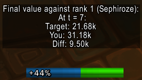
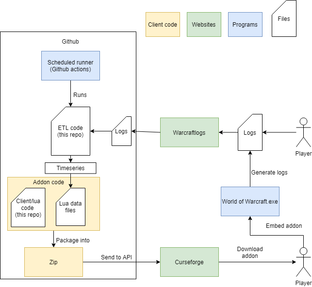

# RTRank
Provides real time comparison against a mythic ranking from Warcraftlogs.  

For example when comparing against rank 1 (you can select the rank), the addon will tell the HPS/DPS of the
target rank at the current timestep into the encounter, and the relative DPS/HPS difference to you. 

For example: At 15 sec into the Wrathion encounter as a Discipline priest the rank 1 target would 
display 967k (total) or 64k (hps). If you were doing 50k hps at this timestep, the addon would also display the diff: 14k hps.

Basic use: "/rtr rank x" - to select your rank to compare to (default rank 1).  
Class, spec, role and encounter will be automatically inferred (Tanks are registered as DPS role for ranking).
Settings are stored across sessions.  

In the current version, ranks 1-2 are available for all specs.
Only mythic raid data is available due to size constraints.

The WCL data is retrieved from https://www.warcraftlogs.com/v1/docs

### Commands (rtr or rtrank):  
* rank (x) -> sets the target rank to compare to to x
* background -> toggle background on or off
* text -> toggle text display on of off
* output (type) -> set output type; allowed values for (type) are "second" and "cumulative"/"total". Ex: For damage, second will show DPS, and cumulative will show total damage for the encounter.

* dummy -> toggle for "dummy use", this will in practice treat all combat entries as an encounter
* reset -> resets to default settings
* dumpdb (encounterID)  -> prints the current database for the specified encounter

### How it works:
The "server" part of the code, in the py folder (python code) will extract the logs from the WCL api, and transform it into timeseries which are embedded in the addon client.
As the addon is running in a lua environment which cannot access files or external endpoints at runtime, all data is generated as "database" files. These are effectively large hardcoded lua tables.
These tables, along with presentation/front-end code is shipped to curseforge. All of this happens by running the full_build_deploy.py script, which is scheduled to run at set intervals in Github Actions.

